# 🚀 Azure APIM & Application Gateway with Function App

This repository contains two Bicep deployment scenarios comparing architectures for routing requests to Azure Functions through API Management with secure VNet integration.

> **Flex Consumption** hosting plan - a cost-effective serverless option with VNet support, offering ~70% savings over Elastic Premium while maintaining network isolation capabilities.

## Scenario : App Gateway → APIM → Function App

🛡️ **Application Gateway** fronting APIM which routes to Azure Function App.

```mermaid
graph LR
    A[👤 Client] -->|HTTP/HTTPS| B[🔒 App Gateway<br/>WAF Enabled]
    B -->|HTTPS| C[🌐 APIM<br/>Internal VNet]
    C -->|VNet| D[⚡ Function App<br/>VNet Integrated]
    D -->|Logs| E[📊 App Insights]
    D -->|Storage| F[💾 Storage Account]
    
    style A fill:#e1f5ff
    style B fill:#ffebee
    style C fill:#fff4e6
    style D fill:#f3e5f5
    style E fill:#e8f5e9
    style F fill:#fce4ec
```



## 📦 Resources Deployed

### 🎯 Common Resources (Both Scenarios)

#### 🌐 Virtual Network
- **Address Space**: 10.0.0.0/16 (Scenario 1) / 10.1.0.0/16 (Scenario 2)
- **Subnets**: Dedicated subnets for each service (APIM, Function, App Gateway)
- **Service Endpoints**: Storage and Web services
- **Subnet Delegation**: Function subnet delegated to serverFarms

#### 🔌 Azure API Management (Developer SKU)
- **VNet Mode**: External (Scenario 1) / Internal (Scenario 2)
- **API Gateway**: Centralized API management and routing
- **Policies**: Request transformation, backend routing, throttling
- **Security**: Subscription keys, OAuth 2.0, mutual TLS support
- **Developer Portal**: Built-in API documentation and testing
- **Analytics**: Request/response logging and metrics

#### ⚡ Azure Function App (Python 3.11)
- **Hosting Plan**: **Flex Consumption** (Serverless, pay-per-use)
- **Instance Memory**: 2048 MB (1 vCPU)
- **Max Instances**: 100 (scales to 1000 with Flex Consumption)
- **VNet Integration**: Secure private connectivity
- **Cold Start**: Reduced with Flex Consumption
- **Scaling**: Event-driven, per-function scaling
- **Runtime**: Python 3.11 on Linux

#### 💾 Storage Account (Standard_LRS)
- **Network Security**: Firewall enabled, VNet-only access
- **Service Endpoints**: Restricted to APIM and Function subnets
- **HTTPS Only**: TLS 1.2 minimum
- **Purpose**: Function app storage, deployment packages

#### 📊 Application Insights
- **Type**: Application Performance Management (APM)
- **Features**: Distributed tracing, request tracking, exception monitoring
- **Integration**: Automatic telemetry from Function App
- **Retention**: 30 days (configurable)

#### 📈 Log Analytics Workspace
- **SKU**: PerGB2018 (pay-as-you-go)
- **Retention**: 30 days
- **Features**: Log queries, workbooks, alerts
- **Integration**: Centralized logging for all resources

### 🛡️ Scenario 2 Additional Resources

#### 🔒 Application Gateway v2 (Standard_v2)
- **Capacity**: 2 instances (autoscale 1-125)
- **Features**: Layer 7 load balancing, SSL offloading, URL-based routing
- **WAF**: OWASP CRS 3.2+, protection against Top 10 threats
- **Performance**: Next-gen engine (8x POST, 4x GET improvement)
- **Bot Protection**: IP reputation, Bot Manager Rule Set
- **DDoS**: Layer 7 DDoS protection
- **Request Size**: Up to 2MB (16x larger than previous)

#### 🌍 Public IP Address
- **SKU**: Standard (static allocation)
- **Purpose**: Internet-facing endpoint for Application Gateway
- **DDoS**: Basic DDoS protection included

## ✅ Prerequisites

- ☁️ Azure CLI installed
- ⚙️ Azure Functions Core Tools installed
- 💻 PowerShell
- 🎫 Azure subscription with appropriate permissions

## 🐍 Function App

The included Python function app (`function-app/`) is a simple echo service that returns request information:

```python
# Returns JSON with:
# - HTTP method
# - URL
# - Headers
# - Query parameters
# - Request body
```

## 🧪 Testing

After deployment:

1. 🔑 **Get APIM subscription key** from Azure Portal:
   - Navigate to APIM resource → Subscriptions → Built-in all-access subscription

2. 🎯 **Test Scenario 1:**
```powershell
$apimUrl = "<apim-gateway-url>"
$subscriptionKey = "<subscription-key>"

Invoke-RestMethod -Method POST -Uri "$apimUrl/echo" `
    -Headers @{"Ocp-Apim-Subscription-Key"=$subscriptionKey} `
    -Body '{"message":"Hello from Scenario 1"}' `
    -ContentType "application/json"
```

3. 🎯 **Test Scenario 2:**
```powershell
$appGwIp = "<app-gateway-public-ip>"
$subscriptionKey = "<subscription-key>"

Invoke-RestMethod -Method POST -Uri "http://$appGwIp/echo" `
    -Headers @{"Ocp-Apim-Subscription-Key"=$subscriptionKey} `
    -Body '{"message":"Hello from Scenario 2"}' `
    -ContentType "application/json"
```

